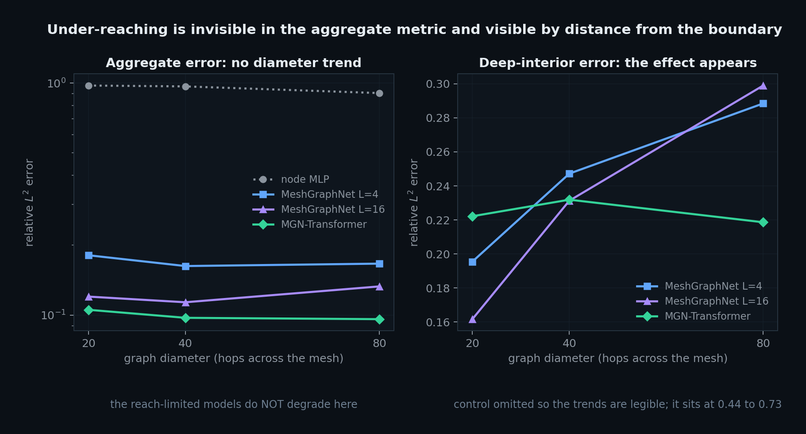

# neuralmesh

**Does global attention actually fix under-reaching in mesh graph networks, or does it
just add parameters?**

[](https://github.com/Samarjithbiswas/neuralmesh/actions/workflows/ci.yml)
[](https://www.python.org/)
[](https://pytorch.org/)
[](LICENSE)
[](tests/)
[](neuralmesh/verify.py)
[](CITATION.cff)

A message-passing network with `L` layers can only see `L` hops. For an elliptic PDE
such as steady diffusion, the solution at an interior node depends on **every**
boundary value, so once the graph diameter exceeds `L` the architecture is
structurally incapable of representing the solution. Not undertrained. Incapable. This
is called **under-reaching**, and no amount of width or epochs fixes it.

Interleaving global attention between message-passing blocks removes the dependence of
receptive field on depth. This repository measures whether that helps, with the
controls needed for the answer to mean anything.

## The claim, and why it needs controls

Plenty of papers report that adding attention improves a graph network. Most of those
comparisons cannot distinguish four different explanations:

1. attention genuinely fixed a reach problem
2. attention added parameters, and any extra capacity would have helped
3. the task never needed long-range information in the first place
4. the error got smaller everywhere, which is not what under-reaching predicts

So this repository does four things differently:

| Control | Why it exists |
|---|---|
| **Parameter counts are matched.** The transformer's width is reduced until it lands within a few percent of the baseline. | Otherwise the experiment measures capacity, not architecture. Rules out (2). |
| **A no-communication model is included.** `NodeMLP` cannot see any other node at all. | Any error level it also reaches was never about the graph. Rules out (3). |
| **Error is reported by distance from the driven boundary.** | Under-reaching predicts worse error *in the middle*, not uniform degradation. Rules out (4). |
| **Ground truth comes from a solver in this repo, verified to second order.** | If the labels were wrong, every learned number would be measuring the wrong thing and still look fine. |

The domain is a long thin strip, because that makes graph diameter grow while node
count stays affordable, and the only long-range driver is the difference between the
left and right Dirichlet values. A model that cannot carry information along the strip
cannot get the interior right.

## Results

Three strip domains of increasing aspect ratio, so graph diameter grows from 20 to 80
while everything else is held fixed: 49 training cases, 90 epochs, hidden width 64,
identical seeds. Relative `L2` error on the test split, interior nodes only.

Reproduce with `python examples/run_underreach.py --sweep 4 8 16 --samples 70 --epochs 90`.
Raw output is committed under [`benchmarks/`](benchmarks/).

<p align="center">
  
</p>

<p align="center"><sub>Regenerate with <code>python examples/plot_results.py</code> (needs <code>pip install -e ".[plot]"</code>).</sub></p>

| diameter | control (no comms) | MeshGraphNet L=4 | MeshGraphNet L=16 | **MGN-Transformer L=4** |
|---:|---:|---:|---:|---:|
| | 17,281 params | 130,113 params | 480,321 params | **130,981 params** |
| | reach 0 hops | reach 4 hops | reach 16 hops | **global** |
| 20 | 0.9750 | 0.1811 | 0.1202 | **0.1054** |
| 40 | 0.9666 | 0.1627 | 0.1136 | **0.0974** |
| 80 | 0.9046 | 0.1666 | 0.1329 | **0.0961** |

The parameter-matched comparison is the middle two columns against the last one:
130,113 versus 130,981 is a 0.7% difference in capacity.

**What holds up.** Against the parameter-matched baseline, interleaving global
attention reduces error by **42%, 40% and 42%** at the three diameters. That
consistency across a 4x change in diameter is the part worth trusting. Attention also
beats the deep baseline that has **3.7x more parameters and four times the depth**, at
every diameter. And the no-communication control sits at 0.90 to 0.98 throughout, which
confirms the task genuinely requires propagating boundary information: any architecture
scoring near 1.0 has learned nothing but the mean.

**What does not hold up, and I am not going to bury it.** The naive prediction is that
a reach-limited model should get *worse as diameter grows*. In the aggregate column it
does not. MeshGraphNet L=4 scores 0.181, 0.163, 0.167 as diameter goes 20, 40, 80.
That is flat. Taken alone, this table does not demonstrate under-reaching at all.

**Where the effect actually shows up.** It is only visible once error is resolved by
distance from the driven boundary. Splitting the interior into four bands, band 0
nearest a driven edge and band 3 at mid-strip:

| deepest band (mid-strip) | d=20 | d=40 | d=80 | change |
|---|---:|---:|---:|---:|
| MeshGraphNet L=4 | 0.195 | 0.247 | 0.288 | **+48%** |
| MeshGraphNet L=16 | 0.162 | 0.231 | 0.299 | **+85%** |
| MGN-Transformer L=4 | 0.222 | 0.232 | 0.219 | **-1%** |

Both purely local models degrade in the middle of the domain as the domain gets longer.
The global model does not: its deep-interior error is essentially independent of
diameter. That is the under-reaching signature, and it is invisible in the aggregate
metric that most comparisons report.

Note that L=16 degrades *more* in the deep interior than L=4 despite far greater depth
and capacity, which is consistent with 16 hops still being well short of an 80-hop
diameter.

### A confound in this sweep, found after publishing it

The sweep above varies diameter by making the strip longer at fixed cross-section, which
means **node count rises with diameter**: 126, 246 and 486 nodes at diameters 20, 40 and
80. So as the distance information must travel goes up, the number of supervised nodes
per training graph goes up with it. The two effects are not separable in this design, and
I should have caught that before putting a diameter trend in a README.

Two things follow, and they point in opposite directions.

*It weakens the aggregate claim badly.* A flat aggregate curve is not evidence of no
effect. It is equally consistent with under-reaching being cancelled by the extra
supervision arriving at the same time.

*It does not obviously destroy the deep-band claim.* More supervision should make the
deep interior easier, so the confound pushes against the observed +48% and +85%
degradation rather than producing it. The effect appearing anyway is suggestive. But
"suggestive despite a confound" is an argument, not a controlled measurement, and larger
domains also change the character of the target field, so I am not going to claim more
than that.

The corrected experiment trades width for length, choosing `(aspect_ratio, ny)` pairs
that hold `nx * ny` fixed, so the strip gets longer *and thinner* and node count stays
put. That pins nodes at 416 to 420 while diameter spans 34 to 104:

```bash
python examples/controlled_sweep.py --nodes 420
```

Until that finishes, treat the diameter *trend* here as unresolved. The
architecture *ranking* at each fixed diameter is unaffected by this confound, because all
four models see exactly the same graphs, and that ranking is what the five-seed result
below tests.

### It does not reproduce in 3D

Running the same protocol on the 3D nonlinear problem gives a **negative result**, and it
is reported here rather than left in a results directory. Aggregate and deep-band error
both *fall* as diameter grows, for every architecture:

| deepest band | d=15 | d=27 | d=39 | change |
|---|---:|---:|---:|---:|
| MeshGraphNet L=4 | 0.305 | 0.223 | 0.160 | **-48%** |
| MeshGraphNet L=16 | 0.227 | 0.226 | 0.181 | **-20%** |
| MGN-Transformer L=4 | 0.289 | 0.153 | 0.159 | **-45%** |

The 3D sweep carries the same node-count confound (208, 400, 592 nodes), and here it is
evidently strong enough to dominate. So this is not yet evidence that under-reaching is
absent in 3D; it is evidence that **this experimental design cannot measure it**, in
either dimension.

What does survive in 3D is the ranking: the transformer beats the parameter-matched
baseline at all three diameters, by 28%, 50% and 25%. Raw output in
[`benchmarks/sweep3d.json`](benchmarks/sweep3d.json).

**One more honest wrinkle.** The transformer is not uniformly better band by band. It is
clearly best nearest the boundary (0.045 to 0.048 against 0.070 to 0.113) but it is
consistently *worse* than the shallow baseline in band 2 at all three diameters. So the
aggregate win is real and reproducible, but it is not the case that attention improves
every region. I do not have a confident explanation for the band 2 behaviour and would
want more seeds before theorising about it.

### It survives reseeding

The table above is one seed per configuration, which makes it suggestive and nothing
more. So the headline was rerun at five seeds, paired within each seed: every seed trains
all four models on the same data in the same order, so seed-to-seed variation is shared
and differencing within a seed removes it.

Diameter 40, five seeds. Raw output in [`benchmarks/seeds_aspect8.json`](benchmarks/seeds_aspect8.json).

| architecture | params | mean relative L2 | std | min | max |
|---|---:|---:|---:|---:|---:|
| control (no comms) | 17,281 | 0.9596 | 0.0354 | 0.9315 | 1.0204 |
| MeshGraphNet L=4 | 130,113 | 0.1625 | 0.0181 | 0.1460 | 0.1843 |
| MeshGraphNet L=16 | 480,321 | 0.1188 | 0.0187 | 0.0869 | 0.1343 |
| **MGN-Transformer L=4** | **130,981** | **0.0864** | **0.0156** | **0.0753** | **0.1124** |

Paired, against the parameter-matched baseline:

```
per-seed improvement: +50.3%, +50.3%, +58.3%, +48.3%, +23.0%
mean +46.0%   std 13.4%   sign agrees on 5/5 seeds
```

Five out of five is a sign test at p = 1/32, so about 0.03 one-sided. That is a small
sample and a weak instrument, and it is the honest summary at five seeds: the direction
is consistent, the magnitude is not tightly pinned. Note also that the transformer's mean
beats the **3.7x larger** deep baseline with the intervals barely overlapping.

Reproduce with `python examples/seed_study.py --seeds 5 --aspect 8`.

**Caveats that still stand.** 49 training cases is small. 90 epochs is short enough that
all four models are still improving. The two-dimensional study is scalar steady
diffusion, which is a deliberately clean setting rather than a hard one. The result is
about architecture ranking under identical budgets, not about absolute accuracy.


## The solver is verified, not assumed

Every learned number above is measured against a P1 finite element solver in
`neuralmesh/fem/`. If that solver were wrong, every result in this repository would be
measuring the wrong thing and would still look fine. So it is checked against twenty
properties whose answers are known in advance from theory, not against stored fixtures:

```bash
neuralmesh verify          # 20 checks, a few seconds
neuralmesh verify --fast   # skip the convergence studies
```

The checks are grouped by the kind of error they catch.

**Algebraic properties** catch sign errors, transposed indices and bad assembly. The
stiffness matrix is symmetric to `0.00e+00` because the bilinear form is. It annihilates
constants to `1.1e-15`, because a constant field has no gradient. The mass matrix
integrates to the domain area exactly. Both matrices have the right definiteness, with
stiffness carrying exactly one zero mode for the constant.

**Consistency checks** catch a solver that assembles correctly and then solves the wrong
problem: linearity in the source, the maximum principle, exact imposition of Dirichlet
data, and a peak response that scales as one over conductivity (measured ratio 8.000
against a conductivity ratio of 8).

**Convergence** is the only check that verifies the discretisation itself, and theory
predicts a specific number. Two independent manufactured solutions are used so one lucky
rate cannot pass the suite:

| manufactured solution | measured rates | theory |
|---|---|---|
| `sin(pi x) sin(pi y)` | 1.947, 1.987 | 2 |
| `x(1-x)y(1-y)` | 1.967, 1.992 | 2 |

**An independent reference** closes the loop. For a unit source on the unit square with
zero boundary data, separation of variables gives a closed-form series. The solver agrees
with it to **0.113% of the peak**, and that comparison relies on no other part of this
codebase being correct.

**The 3D nonlinear solver** contributes seven further checks: exact volume under
interior jitter, positive orientation of every tetrahedron, a 3D patch test to 2.2e-15,
confirmation that the problem is genuinely nonlinear, the finite-difference tangent
check, quadratic Newton convergence, and second-order spatial convergence.

The suite is itself tested. `tests/test_verify.py` monkeypatches a sign error into the
stiffness assembly and asserts the suite notices, because twenty passing checks
otherwise prove only that the checks run.

## A harder problem: 3D nonlinear diffusion

The 2D study above isolates under-reaching cleanly, and that is exactly why it is a weak
headline: a reviewer will reasonably ask whether the result survives real dimensionality
and real nonlinearity. `neuralmesh/fem/mesh3d.py` and `neuralmesh/fem/nonlinear3d.py` are
the first half of answering that.

The problem is quasilinear and elliptic, on tetrahedra:

```
-div( k(u) grad u ) = f        k(u) = k0 (1 + alpha u^2)
```

Genuinely nonlinear, not a linear problem with awkward coefficients: superposition fails
by **38%** at the amplitudes used in the verification suite, so `u(2f)` is not `2u(f)`.
It stays elliptic, so the interior still depends on every boundary value, which is the
property under-reaching is about. And it admits an exact manufactured solution, so it can
be verified rather than trusted.

Solved by Newton-Raphson with a **consistent tangent**, including the `dk/du` term. That
term is easy to omit, and omitting it still converges, just linearly, with the converged
answer still looking correct. Two checks catch it:

- the analytic Jacobian is compared column by column against a finite-difference
  Jacobian, agreeing to **2.3e-08**
- the observed Newton order is **2.61, 1.96, 2.06**, and quadratic convergence is the
  signature of a correct tangent

The 3D discretisation is verified the same way as the 2D one, by manufactured solution:
measured rates **1.729, 1.91** against a theoretical 2.

```python
from neuralmesh.fem.mesh3d import box_mesh, bar_mesh
from neuralmesh.fem.nonlinear3d import solve_nonlinear, manufactured, PowerLawConductivity

law = PowerLawConductivity(k0=1.0, alpha=1.0)
exact, source = manufactured(law)
sol = solve_nonlinear(box_mesh(9, 9, 9), source=source, law=law, dirichlet_value=exact)
print(sol.converged, sol.l2_error(exact), sol.history.convergence_orders())
```

`bar_mesh` is the 3D analogue of the 2D strip, so the same diameter-versus-reach
experiment can be run on this problem. Training the learned models on it is the next
step and is **not done yet**: see [ROADMAP.md](ROADMAP.md) for what is and is not
finished.

## Install

```bash
git clone https://github.com/Samarjithbiswas/neuralmesh.git
cd neuralmesh
pip install torch --index-url https://download.pytorch.org/whl/cpu
pip install -e ".[dev]"
pytest -q
```

CPU only, deliberately. Every number in this README is reproducible on a laptop, and
pinning a CUDA build would make that false for most readers.

## Use it

```bash
neuralmesh verify                              # check the solver
neuralmesh solve --nx 24 --ny 8 --width 6      # one case, with graph diameter
neuralmesh dataset --samples 200               # generate and cache training data
neuralmesh train --arch mesh_graph_transformer --epochs 120
neuralmesh study --aspect 8 --out results.json # the comparison
```

As a library:

```python
from neuralmesh import (
    strip_mesh, solve_poisson, graph_from_solution, graph_diameter,
    build_model, ModelConfig, count_parameters,
)

mesh = strip_mesh(length=8.0, height=1.0, ny=6)
sol = solve_poisson(mesh, source=1.0, dirichlet_value=0.0)
graph = graph_from_solution(sol)

print(graph.summary(), "diameter", graph_diameter(graph))

model = build_model("mesh_graph_transformer", ModelConfig(hidden_dim=64, n_blocks=4))
print(count_parameters(model), "parameters, reach", model.receptive_hops)
```

`receptive_hops` returns `0` for the control, `n_blocks` for pure message passing, and
`-1` meaning global once any attention layer is present.

## Reproduce the study

```bash
python examples/run_underreach.py --quick              # a few minutes, checks plumbing
python examples/run_underreach.py                      # the headline configuration
python examples/run_underreach.py --sweep 4 8 16       # error against graph diameter
```

## What is in here

```
neuralmesh/
  mesh/geometry.py      TriMesh, structured and jittered meshes, uniform refinement
  mesh/graph.py         mesh to graph, relative-geometry edge features, BFS diameter
  fem/poisson.py        2D P1 assembly, Dirichlet constraints, verified convergence
  fem/mesh3d.py         tetrahedral meshes, Kuhn subdivision, quality metrics
  fem/nonlinear3d.py    3D nonlinear diffusion, Newton with a consistent tangent
  models/blocks.py      MLP, residual message passing, physics attention with
                        a learned distance bias, chunked to bound O(N^2) memory
  models/architectures.py  the three architectures plus capacity matching
  data/dataset.py       Latin hypercube sampling, train-only normalisation, caching
  train/trainer.py      training loop, masked losses, opt-in physics residual
  evaluate/underreach.py   the experiment and its controls
  cli.py                command line
tests/                  112 tests, physics properties rather than stored fixtures
  verify.py             13-check verification suite, with a test that sabotages the
                        solver to prove the suite would notice
examples/               reproduce the study
```

Some design choices worth flagging, because they change what the model can learn:

- **Edges carry relative geometry only.** Edge features are the displacement vector
  between endpoints and its length. Nothing in the message-passing path sees an
  absolute coordinate, so translation invariance holds by construction rather than by
  hoping the training data covered every position. There is a test that permutes node
  labels and asserts the prediction is unchanged.
- **Sum aggregation, not mean.** The physical quantity being passed between nodes is a
  flux, and sums are what conserve it.
- **Residual message-passing updates.** Without them, stacking the fifteen-plus blocks
  needed to span a long strip drives activations to a fixed point and training stalls.
- **Boundary nodes are excluded from the loss.** Their values are inputs, not
  predictions. Scoring them inflates every metric, because the model gets credit for
  copying a feature it was handed, and on a fine mesh the boundary can be a third of
  all nodes.
- **Normalisation is fitted on the training split only.** Fitting on everything leaks
  distributional information and flatters the reported error. This is the most common
  silent mistake in surrogate work, so there is a test for it.
- **The physics residual is off by default.** It is implemented and tested, but
  weighting a PDE residual against a data term is a real hyperparameter with real
  failure modes, and reporting a number obtained with an untuned physics weight would
  be misleading.

## Honest limits

- **This is a 2D scalar diffusion problem.** Steady, linear, single field. It is chosen
  because under-reaching is cleanest to isolate there, not because it is hard. Nothing
  here demonstrates anything about Navier-Stokes or nonlinear solid mechanics.
- **Attention is O(N^2) in node count.** Fine at these mesh sizes, and the reason
  production systems reach for hierarchical or spectral alternatives instead.
- **The datasets are small.** Hundreds of solves, not hundreds of thousands. Absolute
  error levels here are not competitive with a well-resourced surrogate and are not
  meant to be. What is being compared is architectures under identical budgets.
- **Reported error is a test-split average.** Averages hide the extremes, which is
  exactly where design decisions usually get made. That is why the per-distance-band
  breakdown is reported alongside.
- **Attention is not the only fix.** Hierarchical pooling, multigrid-inspired
  transfers, and spectral operators all attack the same problem, and this repository
  does not compare against them.

## Background

The under-reaching framing follows the mesh-based learned-simulation literature:
MeshGraphNet (Pfaff et al., *Learning Mesh-Based Simulation with Graph Networks*),
the over-smoothing and over-squashing results from graph learning, and neural operator
work (FNO, DeepONet) where global coupling is obtained spectrally rather than by
attention.

## License

MIT. See [LICENSE](LICENSE).

---

Built by [Samarjith Biswas, Ph.D.](https://samarjithbiswas.com) &nbsp;·&nbsp;
wave physics, acoustic metamaterials, and machine learning for simulation
